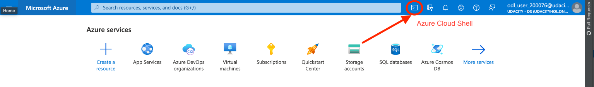
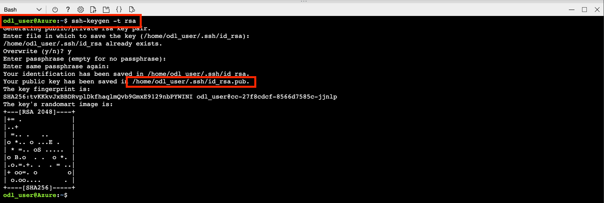
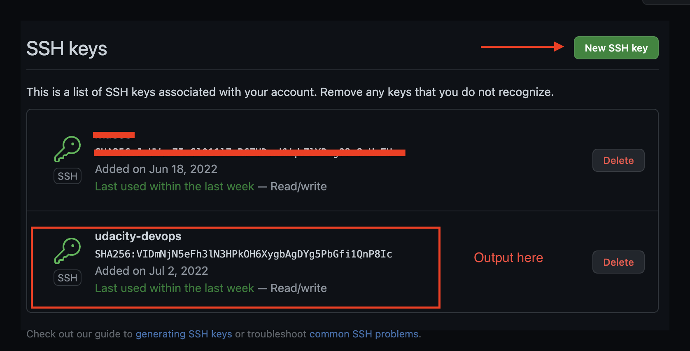
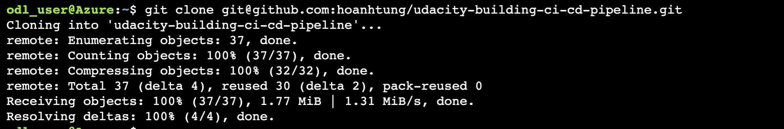
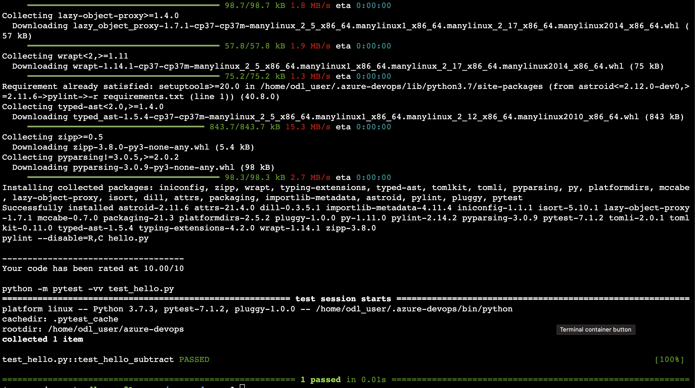

[](https://github.com/hoanhtung/udacity-building-ci-cd-pipeline/actions/workflows/pythonapp.yml)

# Overview
For this project, you will do CI/CD with GitHub Actions and Azure Pipeline. Especially, you will set up Azure Pipelines to deploy the Flask ML Service Project to Azure App Service.

## Project Plan

* A [Trello Board](https://trello.com/invite/b/zMa646vF/bb49c58c8ab64dd611ee56fb07d2365e/project-management-building-a-ci-cd-pipeline) for tracking tickets in project
* A [Spreadsheet](Project-Management-Template.xlsx) for managing project by timeline

## Dependencies

* Create an [Azure Account](https://portal.azure.com)
* Create a [GitHub Account](https://github.com/)

## Instructions

Architectural Diagram

* Project running on Azure App Service
### Set up Azure Cloud Shell
1. Access to Azure Portal page & open Azure Cloud Shell



2. Generate ssh-keys by running `ssh-keygen -t rsa` cmd
3. Copy the value of ssh-keys by running `cat [root]/.ssh/id_rsa.pub` cmd (root here is `/home/odl_user`)



4. Navigate to [SSH and GPG keys](https://github.com/settings/keys) and upload ssh-keys to GitHub


### Clone the project repo into Azure Cloud Shell
1. After add SSH key to GitHub, let's run the cmd below in Azure Cloud Shell to clone the project repo:
```
git clone git@github.com:hoanhtung/udacity-building-ci-cd-pipeline.git
```

### Run Makefile
1. (Optional) Set up virtual environment
```
python3 -m venv ~/.my-venv
source ~/.my-venv/bin/activate
```
2. Run `make all` cmd to install libraries in `requirements.txt` file, run pylint and pytest


### Deploy Azure App Service
* Successful deploy of the project in Azure Pipelines.  [Note the official documentation should be referred to and double checked as you setup CI/CD](https://docs.microsoft.com/en-us/azure/devops/pipelines/ecosystems/python-webapp?view=azure-devops).

* Running Azure App Service from Azure Pipelines automatic deployment

* Successful prediction from deployed flask app in Azure Cloud Shell.  [Use this file as a template for the deployed prediction](https://github.com/udacity/nd082-Azure-Cloud-DevOps-Starter-Code/blob/master/C2-AgileDevelopmentwithAzure/project/starter_files/flask-sklearn/make_predict_azure_app.sh).
The output should look similar to this:

```bash
udacity@Azure:~$ ./make_predict_azure_app.sh
Port: 443
{"prediction":[20.35373177134412]}
```

* Output of streamed log files from deployed application

> 

## Enhancements

<TODO: A short description of how to improve the project in the future>

## Demo 

<TODO: Add link Screencast on YouTube>
