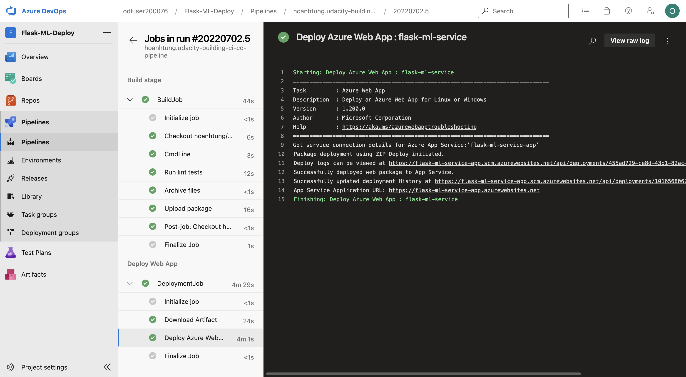

[](https://github.com/hoanhtung/udacity-building-ci-cd-pipeline/actions/workflows/pythonapp.yml)

# Overview
For this project, you will do CI/CD with GitHub Actions and Azure Pipeline. Especially, you will set up Azure Pipelines to deploy the Flask ML Service Project to Azure App Service.

## Project Plan

* A [Trello Board](https://trello.com/invite/b/zMa646vF/bb49c58c8ab64dd611ee56fb07d2365e/project-management-building-a-ci-cd-pipeline) for tracking tickets in project
* A [Spreadsheet](Project-Management-Template.xlsx) for managing project by timeline

## Dependencies

* Create an [Azure Account](https://portal.azure.com)
* Create a [GitHub Account](https://github.com/)

## Instructions

Architectural Diagram

### Set up Azure Cloud Shell
1. Access to Azure Portal page & open Azure Cloud Shell


2. Generate ssh-keys by running `ssh-keygen -t rsa` cmd
3. Copy the value of ssh-keys by running `cat [root]/.ssh/id_rsa.pub` cmd (root here is `/home/odl_user`)


4. Navigate to [SSH and GPG keys](https://github.com/settings/keys) and upload ssh-keys (copied value) to GitHub


### Clone the project repo into Azure Cloud Shell
1. After add SSH key to GitHub, let's run the cmd below in Azure Cloud Shell to clone the project repo:
```
git clone git@github.com:hoanhtung/udacity-building-ci-cd-pipeline.git
```

### Run Makefile
1. (Optional) Set up virtual environment
```
python3 -m venv ~/.my-venv
source ~/.my-venv/bin/activate
```
2. Access to project folder
3. Run `make all` cmd to install libraries in `requirements.txt` file, run pylint and pytest


### Deploy to Azure App Service
1. Assign values of service app into parameters `--name`, `--resource-group`, `--location`, `--sku` in `commands.sh` file
2. Run `./commands.sh` to deploy the project to Azure App Service
3. After deploying is successful, we can access to home page of web app service. Output here:


### Test run using GitHub Action

1. Output of the test run on GitHub Action:


### Set up Azure Pipelines
1. [Create an Azure DevOps project and connect to Azure](https://docs.microsoft.com/en-us/azure/devops/pipelines/ecosystems/python-webapp?view=azure-devops#create-an-azure-devops-project-and-connect-to-azure)
2. [Use CI/CD to deploy a Python web app to Azure App Service on Linux](https://docs.microsoft.com/en-us/azure/devops/pipelines/ecosystems/python-webapp?view=azure-devops#create-a-python-specific-pipeline-to-deploy-to-app-service)
3. [Run the Azure pipeline](https://docs.microsoft.com/en-us/azure/devops/pipelines/ecosystems/python-webapp?view=azure-devops#run-the-pipeline) and output after deploying successfully:



4. Access to Deployment Center page in the Azure portal to view deployment histories


5. We can see the streamed log of the application in Log Stream menu 


6. Run `./make_predict_azure_app.sh` cmd to test the Predict API and output here:


### Locust load test


## Enhancements

In the future, I think the repository will be large, so I want to reduce checkout time, limit how far back in history to download.
It is good approach to use fetchDepth to do a [shallow fetch](https://docs.microsoft.com/en-us/azure/devops/pipelines/repos/pipeline-options-for-git?view=azure-devops&tabs=yaml#shallow-fetch) which could improve performance and also help you conserve network and storage resources.

## Demo 
[Demo on Youtube](https://youtu.be/Hu058Zl8rWg)
